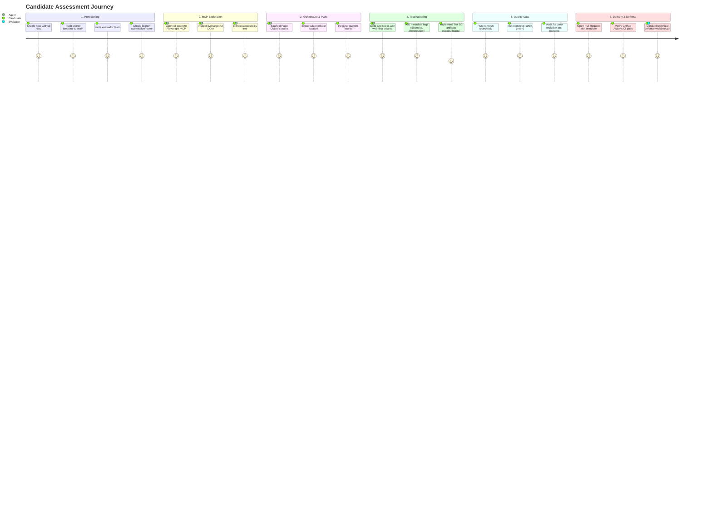
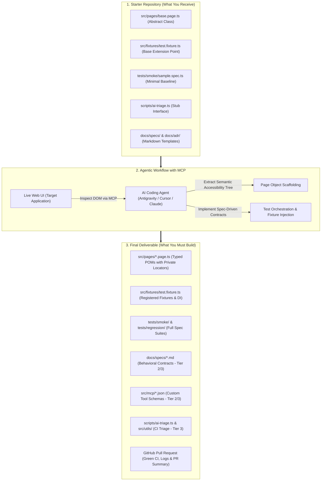

# Playwright & Model Context Protocol (MCP) QA Assessment Framework

## 1. Overview & Purpose

This repository provides a standardized, universal technical assessment framework designed to evaluate Quality Assurance (QA) engineers and Software Development Engineers in Test (SDET) on modern test automation using **Playwright** integrated with the **Model Context Protocol (MCP)** and AI coding agents.

The assessment evaluates practical judgment, architectural discipline, robust automation standards, and effective human-AI collaboration. Candidates are not evaluated on typing every line of code manually; rather, they are assessed on their ability to orchestrate AI agents, use MCP tools for deterministic browser inspection, enforce strict testing patterns, and validate AI-generated artifacts for production readiness.

This repository is **one clone**: the assessment brief and rubric sit on top of a working Playwright starter (POM, fixtures, optional API client, Cursor/Claude tooling). After `npm ci` and `npm run test:smoke`, follow [ASSESSMENT_BRIEF.md](ASSESSMENT_BRIEF.md). Canonical engineering rules: [AGENTS.md](AGENTS.md). Setup: [docs/GETTING_STARTED.md](docs/GETTING_STARTED.md).

---

## 2. Zero-Cost Infrastructure & Recommended AI Models ($0 Budget Setup)

The entire assessment framework can be executed at **$0 total cost** by combining Google Antigravity, Google AI Studio free tier quotas, local open-source MCP servers, and GitHub Actions free minutes.

For detailed step-by-step setup instructions, refer to the dedicated [Zero-Cost Environment Setup Guide](docs/FREE_SETUP_GUIDE.md).

### Zero-Cost Stack Summary

| Component | Free Solution | Cost | Quota / Free Capacity |
| :--- | :--- | :--- | :--- |
| **Agentic IDE** | **Google Antigravity IDE** | $0 (Free) | Native MCP server discovery, agent orchestration, and sub-agent workflows. |
| **Frontier LLM** | **Gemini 2.0 Flash / Pro** (via Google AI Studio) | $0 (Free Tier) | 15 RPM, 1,000,000 TPM, 1,500 free requests per day. |
| **Local MCP Server** | `@executeautomation/playwright-mcp-server` | $0 (Open Source) | Local Chromium control via `npx`; zero cloud compute cost. |
| **Browser Engine** | Playwright Chromium Binaries | $0 (Open Source) | High-speed local browser execution engine. |
| **CI/CD Pipeline** | GitHub Actions | $0 (Free Tier) | 2,000 free runner minutes per month. |
| **Offline LLM (Optional)** | Ollama (`qwen2.5-coder:14b` / `llama3.3`) | $0 (Open Source) | 100% offline local model execution without internet connection. |

### LLM Model Recommendations

| Model | Recommendation Level | Primary Strengths | Best Used For |
|-------|----------------------|-------------------|---------------|
| **Anthropic Claude 3.7 Sonnet / Claude 3.5 Sonnet** | **Highly Recommended (Frontier)** | Industry-leading tool-calling accuracy, deep context reasoning, zero locator hallucination, strict adherence to negative system prompt constraints. | Live DOM inspection, Page Object scaffolding, complex dynamic test orchestration. |
| **Google Gemini 2.0 Flash / Pro** | **Highly Recommended (Zero-Cost)** | Large context window handling (1M tokens), fast multi-turn debugging, strong multimodal reasoning for screenshot/trace triage, generous free tier. | Large test report analysis, trace diagnostics, token-efficient triage scripts. |
| **OpenAI GPT-4o** | **Recommended** | High instruction-following fidelity, fast generation velocity, accurate schema definition. | Spec-Driven Development, fixture extension, data generation schemas. |

### Supported AI Coding Environments
- **Antigravity IDE** (Native MCP Tooling & Sub-agent Orchestration — Free)
- **Cursor IDE** (Composer / Agent Mode with Playwright MCP)
- **Claude Desktop** (Configured with local Playwright MCP Server)
- **Windsurf IDE** (Cascade Agent with MCP integration)

---

## 3. End-to-End Candidate Journey: From Start to Finish

This journey outlines the exact path every candidate follows from the moment the assessment starts to the final technical defense, defining what is expected at each milestone without providing pre-solved code.

### Visual Journey & Milestone Flow



---

### Visual Deliverable Transformation: Starter Skeleton vs. Final Delivery



---

### Detailed Stage-by-Stage Journey Breakdown

#### Stage 1: Kickoff & Environment Provisioning (Minutes 0 - 15)
- **Goal**: Establish a clean working repository and grant evaluator access.
- **Actions Required**:
  1. Create a new private repository on your GitHub account (e.g., `qa-assessment-playwright-<your-name>`).
  2. Push the base starter template to your `main` branch.
  3. Go to **Settings > Collaborators > Add People** and invite the evaluation team handles.
  4. Create your submission branch: `git checkout -b submission/<your-name>`.
  5. Run `npm install` and verify the baseline passes with `npm run typecheck && npm run test:smoke`.
- **Exit Criteria**: Baseline test passes locally, evaluators have repository access, and your feature branch is active.

#### Stage 2: Exploration & Live UI Inspection via MCP (Minutes 15 - 30)
- **Goal**: Direct your AI agent to inspect the target application live using the Model Context Protocol.
- **Actions Required**:
  1. Receive your assigned Tier and target scenario from the brief (or facilitator).
  2. Prompt your AI agent (Antigravity, Cursor, or Claude) to connect to the local Playwright MCP server.
  3. Instruct the agent to navigate to the target application URL and inspect the relevant UI component subtrees.
  4. Instruct the agent to extract the semantic accessibility tree (roles, accessible names, placeholders).
- **Expectations & Good Judgment**:
  - Do not guess locators manually or accept brittle CSS/XPath selectors from the agent.
  - Ensure the agent relies on semantic accessibility roles (`getByRole`, `getByLabel`, `getByPlaceholder`, `getByTestId`).
- **Exit Criteria**: Verified set of unique, robust accessibility locators identified via live MCP inspection.

#### Stage 3: Architectural Construction (POM & Custom Fixtures) (Minutes 30 - 60)
- **Goal**: Scaffold maintainable Page Object Models and wire them into Playwright fixtures.
- **Actions Required**:
  1. Direct your agent to create typed Page Object classes in `src/pages/*.page.ts` extending `BasePage`.
  2. Ensure all locators are private read-only properties inside the POM class.
  3. Define public user action methods that represent high-level user workflows and return typed Promises.
  4. Register all Page Objects in `src/fixtures/test.fixture.ts` using `test.extend<CustomFixtures>()`.
  5. *(Tier 2/3)*: Author behavioral feature contract specifications in `docs/specs/` and custom MCP tool schemas in `src/mcp/`.
- **Expectations & Good Judgment**:
  - Never allow direct locator definitions inside test spec files.
  - Never instantiate Page Objects with `new MyPage(page)` inside specs; always inject via custom fixtures.
- **Exit Criteria**: Page Objects and fixtures compile with 0 TypeScript compiler errors.

#### Stage 4: Test Suite Implementation & Web-First Assertions (Minutes 60 - 90+)
- **Goal**: Author deterministic, auto-waiting test suites.
- **Actions Required**:
  1. Create test spec files in `tests/smoke/` (for `@smoke`) and/or `tests/regression/` (for `@regression`).
  2. Import `test` and `expect` exclusively from `@fixtures` (or `../../src/fixtures/test.fixture`).
  3. Consume injected Page Objects from fixture arguments.
  4. Write asynchronous, auto-waiting assertions (`await expect(locator).toBeVisible()`, `await expect(locator).toHaveText()`).
  5. *(Tier 3)*: Implement `scripts/ai-triage.ts`, `src/utils/security-sanitizer.ts`, and `docs/adr/ADR-TEMPLATE.md`.
- **Expectations & Good Judgment**:
  - `page.waitForTimeout()` is strictly forbidden across all files.
  - Validate that every Playwright API call is real, valid, and properly awaited.
- **Exit Criteria**: Test suite covers all scenarios specified in the brief.

#### Stage 5: Local Validation & Quality Assurance Gate
- **Goal**: Guarantee zero defects and adherence to engineering rules before pushing.
- **Actions Required**:
  1. Run `npm run typecheck` — must exit with 0 errors.
  2. Run `npm test` (or `npm run test:smoke` / `npm run test:regression`) — all tests must pass 100% green across consecutive runs.
  3. Perform a self-audit against the Pre-Commit Checklist in `AGENTS.md`.
- **Exit Criteria**: 100% green test execution and clean static analysis locally.

#### Stage 6: Pull Request Submission & Technical Defense
- **Goal**: Deliver a transparent engineering package and defend technical choices.
- **Actions Required**:
  1. Commit your changes and push the branch: `git push -u origin submission/<your-name>`.
  2. Open a Pull Request from `submission/<your-name>` into `main`.
  3. Complete the standardized Pull Request Description Template (Summary, MCP Tool Invocations, Prompts Used, AI Corrections Made, Test Evidence).
  4. Share the Repository URL and Pull Request Link with the evaluation committee.
  5. Attend the 20-30 minute technical defense walkthrough with evaluators (walk through architecture, explain prompt iterations, and resolve a live simulated UI failure).
- **Exit Criteria**: Pull Request submitted, CI pipeline green, and technical defense completed.

---

## 4. Universal Candidate Deliverables Matrix

Every candidate must deliver the following standardized artifacts corresponding to their assigned tier:

| Artifact | Location | Description | Applicable Tiers |
|----------|----------|-------------|------------------|
| **Page Object Models** | `src/pages/*.page.ts` | Typed Page Object classes encapsulating private locators (`getByRole`, `getByLabel`, `getByTestId`) and public user actions. | All Tiers (1, 2, 3) |
| **Custom Fixtures** | `src/fixtures/test.fixture.ts` | Extended Playwright fixtures providing dependency injection for Page Objects into test contexts. | All Tiers (1, 2, 3) |
| **Test Spec Files** | `tests/smoke/` & `tests/regression/` | Spec files importing exclusively from `@fixtures` with web-first assertions and descriptive tags (`@smoke`, `@regression`). Zero direct locators. | All Tiers (1, 2, 3) |
| **Pull Request Submission** | GitHub Pull Request | Detailed PR containing summary of changes, MCP tool invocation log, prompt iteration history, and validation evidence. | All Tiers (1, 2, 3) |
| **Feature Contract Spec** | `docs/specs/*.md` | Typed behavioral specification following Spec-Driven Development principles. | Tier 2 & Tier 3 |
| **Custom MCP Schema / Skill** | `src/mcp/` or `.agents/` | JSON-RPC tool schema definition or sub-agent orchestration workflow. | Tier 2 & Tier 3 |
| **CI/CD Pipeline & AI Triage** | `.github/workflows/` & `scripts/` | GitHub Actions workflow and automated failure triage diagnostic script. | Tier 3 |
| **Security Sanitizer** | `src/utils/security-sanitizer.ts` | PII and credential redaction module for AI prompt governance. | Tier 3 |
| **Architecture Decision Record**| `docs/adr/*.md` | Structured ADR documenting architectural topology, SLOs, and cost trade-offs. | Tier 3 |

---

## 5. Assessment Tiers & Scoring Benchmarks

| Tier | Level | Target Timebox | Core Scope | Minimum Passing Score |
|------|-------|----------------|------------|-----------------------|
| **Tier 1** | Foundational | 60 - 90 minutes | MCP DOM inspection, Page Object generation, custom fixtures, token efficiency, smoke validation. | 80% (36 / 45 pts) |
| **Tier 2** | Advanced | 2 - 4 hours | Spec-Driven Development, custom MCP tool schema / sub-agents, dynamic state handling, API mocking. | 85% (72 / 85 pts) |
| **Tier 3** | Master / Certification | 4 - 6 hours (Half Day) | Enterprise CI/CD pipeline, AI failure triage & trace analyzer, DOM security sanitization, ADR. | 90% (95 / 105 pts) |

---

## 6. Step-by-Step Deliverable Walkthrough (Illustrative Reference)

The following walkthrough demonstrates how to complete an assessment scenario using an AI agent with MCP integration:

### Step 1: Branch Creation
```bash
git checkout -b submission/jane-doe-assessment
```

### Step 2: Live DOM Inspection via MCP
Direct your AI coding assistant to use the configured Playwright MCP server to inspect the target application:

**Example Prompt**:
```text
Navigate to the target portal using the Playwright MCP server. Inspect the login form and header navigation bar. Extract the semantic accessibility roles (roles, labels, placeholders) for the username input, password input, submit button, and settings menu link.
```

**Observed MCP Interaction**:
```json
{
  "tool": "playwright_inspect_dom",
  "parameters": {
    "url": "https://example.app/login",
    "selector": "form.login-box"
  },
  "result": {
    "accessibility_tree": [
      { "role": "textbox", "name": "Username" },
      { "role": "textbox", "name": "Password", "type": "password" },
      { "role": "button", "name": "Sign In" }
    ]
  }
}
```

### Step 3: Authoring the Page Object Model
Create a typed Page Object in `src/pages/` encapsulating locators as private properties:

```typescript
// src/pages/auth.page.ts
import { type Page, type Locator, expect } from '@playwright/test';
import { BasePage } from './base.page';

export class AuthPage extends BasePage {
  private readonly usernameInput: Locator;
  private readonly passwordInput: Locator;
  private readonly signInButton: Locator;
  private readonly userGreeting: Locator;

  constructor(page: Page) {
    super(page);
    this.usernameInput = page.getByLabel('Username');
    this.passwordInput = page.getByLabel('Password');
    this.signInButton = page.getByRole('button', { name: 'Sign In' });
    this.userGreeting = page.getByRole('heading', { level: 2 });
  }

  async login(user: string, pass: string): Promise<void> {
    await this.usernameInput.fill(user);
    await this.passwordInput.fill(pass);
    await this.signInButton.click();
  }

  async verifyLoggedIn(expectedUser: string): Promise<void> {
    await expect(this.userGreeting).toContainText(expectedUser);
  }
}
```

### Step 4: Registering the Custom Fixture
Register the Page Object in `src/fixtures/test.fixture.ts`:

```typescript
// src/fixtures/test.fixture.ts
import { test as baseTest, expect } from '@playwright/test';
import { AuthPage } from '../pages/auth.page';

export type CustomFixtures = {
  authPage: AuthPage;
};

export const test = baseTest.extend<CustomFixtures>({
  authPage: async ({ page }, use) => {
    const authPage = new AuthPage(page);
    await use(authPage);
  },
});

export { expect };
```

### Step 5: Authoring the Test Spec
Author the spec in `tests/smoke/auth.spec.ts` without direct locator queries:

```typescript
// tests/smoke/auth.spec.ts
import { test, expect } from '../../src/fixtures/test.fixture';

test.describe('Authentication & Dashboard Flow @smoke @foundational', () => {
  test('should successfully sign in with valid credentials', async ({ authPage, page }) => {
    await page.goto('/login');
    await authPage.login('standard_user', 'secret_pass');
    await authPage.verifyLoggedIn('standard_user');
  });
});
```

### Step 6: Validating Quality Gates Locally
```bash
npm run typecheck
npm run test:smoke
```

### Step 7: Opening Pull Request & Submitting
Open the Pull Request against `main`, fill out the PR description template with tool logs, and provide the repo and PR URLs to the evaluation team.

---

## 7. Repository Structure

```text
.
├── ASSESSMENT_BRIEF.md         # Comprehensive candidate instructions and tier challenges
├── AGENTS.md                   # System rules, coding standards, POM conventions, and MCP constraints
├── docs/
│   ├── FREE_SETUP_GUIDE.md     # Dedicated zero-cost setup guide ($0 budget)
│   ├── GETTING_STARTED.md      # Environment setup, Playwright config, and MCP server connectivity
│   ├── FACILITATOR_GUIDE.md    # Evaluator instructions, oral defense question bank, and scoring sheets
│   ├── SAMPLE_CHALLENGES.md    # Pre-built practical challenge scenarios for each tier
│   ├── specs/
│   │   └── SPEC-TEMPLATE.md    # Feature contract specification template (Tier 2/3)
│   └── adr/
│       └── ADR-TEMPLATE.md     # Architecture Decision Record template (Tier 3)
├── src/
│   ├── fixtures/
│   │   └── test.fixture.ts     # Central custom fixtures extending test & expect
│   ├── pages/
│   │   ├── base.page.ts        # Abstract base page object
│   │   └── *.page.ts           # Candidate-authored Page Object Models
│   ├── utils/
│   │   └── security-sanitizer.ts # Security & PII sanitizer module (Tier 3)
│   └── mcp/
│       └── example-tool-schema.json # Custom MCP tool schema template (Tier 2/3)
├── tests/
│   ├── smoke/
│   │   └── sample.spec.ts      # Smoke test specs (@smoke)
│   └── regression/             # Comprehensive regression test specs (@regression)
├── scripts/
│   └── ai-triage.ts            # AI diagnostic & failure triage script (Tier 3)
├── .github/
│   └── workflows/
│       └── test-automation.yml # CI/CD execution & triage workflow (Tier 3)
├── playwright.config.ts        # Playwright runner configuration
├── package.json                # Dependencies and scripts
└── tsconfig.json               # Strict TypeScript compiler options
```

---

## 8. Quick Start

1. Install dependencies:
   ```bash
   npm install
   ```
2. Install Playwright browser binaries:
   ```bash
   npx playwright install --with-deps chromium
   ```
3. Configure your local MCP server following [docs/FREE_SETUP_GUIDE.md](docs/FREE_SETUP_GUIDE.md) or [docs/GETTING_STARTED.md](docs/GETTING_STARTED.md).
4. Run baseline healthcheck:
   ```bash
   npm run typecheck && npm run test:smoke
   ```

---

## 9. Non-Negotiable Engineering Rules

- **Zero Direct Locators in Specs**: `page.locator()` or `page.$()` inside `tests/**/*.spec.ts` is strictly prohibited. All locators must be private in POM classes.
- **Dependency Injection**: Never instantiate Page Objects with `new MyPage(page)` inside spec files. Consume from `@fixtures`.
- **Zero Arbitrary Timeouts**: `page.waitForTimeout()` is strictly forbidden. Use auto-waiting web-first assertions (`await expect(...)`).
- **No Hallucinations**: Every Playwright API call must be valid, verified, and correctly awaited.
- **Zero Secret Commits**: Never commit `.env` files, API keys, or credentials.
