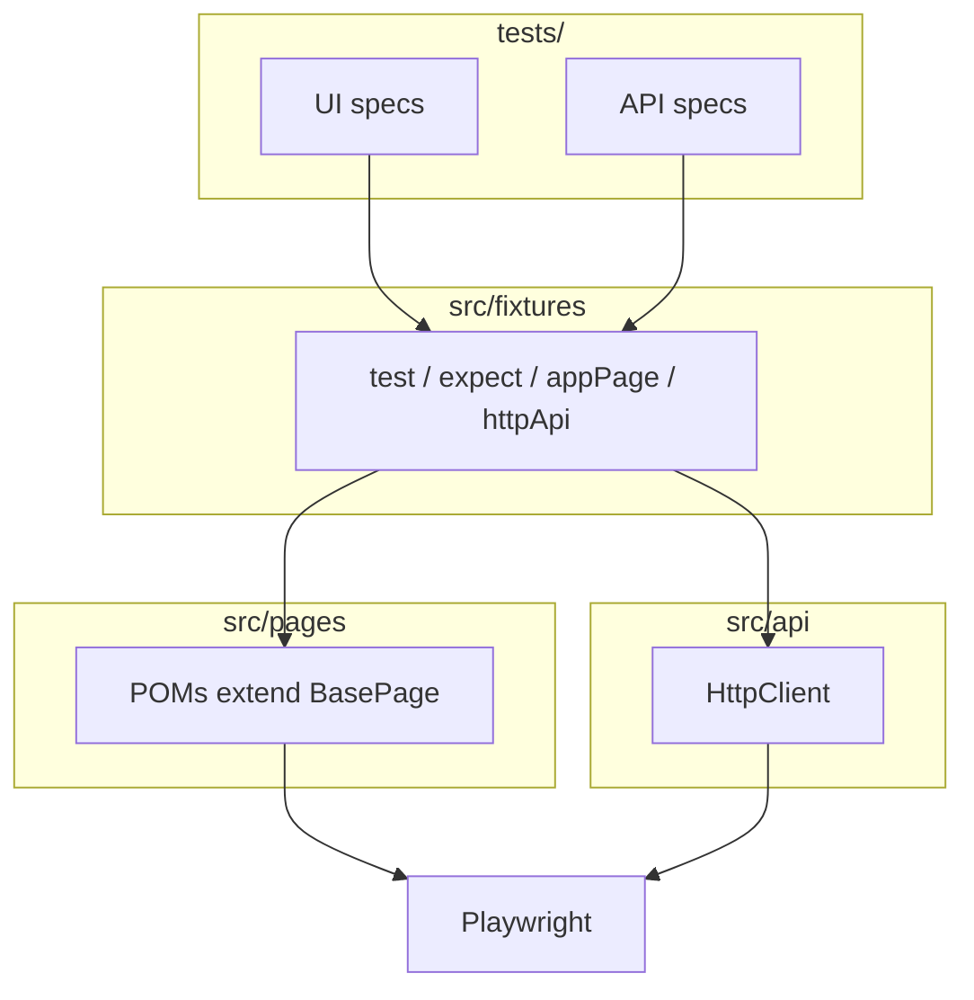
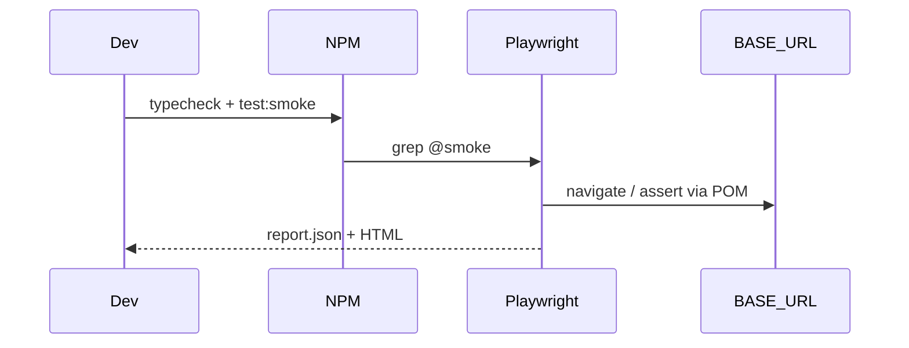
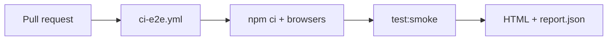

# Framework overview

High-level view of the Playwright QA seed. Details and standards live in [`AGENTS.md`](../AGENTS.md).

## Layers

## Local run lifecycle

## CI (example)

## Tag strategy

| Tag | Intent |
|-----|--------|
| `@smoke` | Fast PR gate |
| `@regression` | Broader coverage, not always on every PR |
